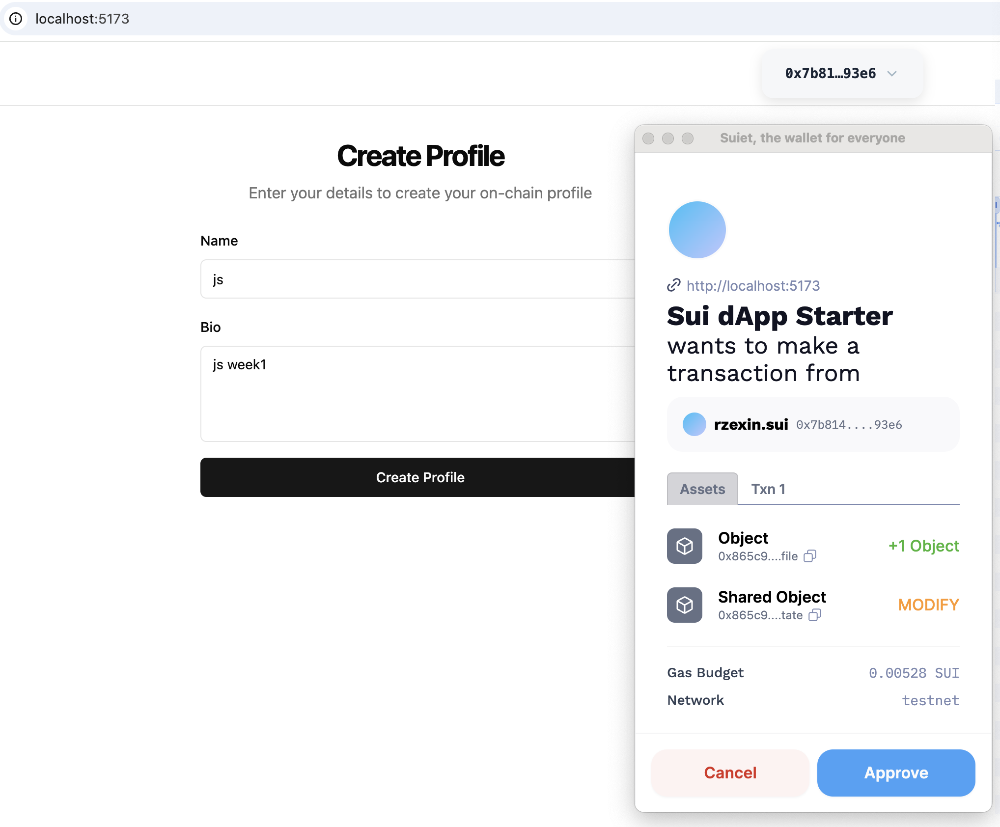
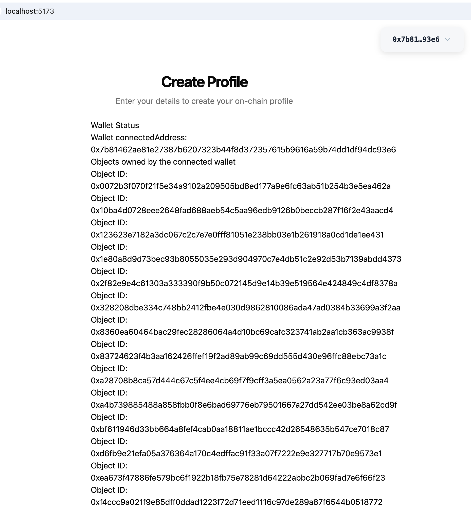

## 合约部署

```bash
sui client publish
[warning] Client/Server api version mismatch, client api version : 1.39.0, server api version : 1.42.3
UPDATING GIT DEPENDENCY https://github.com/MystenLabs/sui.git
INCLUDING DEPENDENCY Sui
INCLUDING DEPENDENCY MoveStdlib
BUILDING test
Successfully verified dependencies on-chain against source.
Transaction Digest: AtfMpxyWwb8DswLc4U76NtV8mfzP47k31hRAGF5szoJE
╭──────────────────────────────────────────────────────────────────────────────────────────────────────────────╮
│ Transaction Data                                                                                             │
├──────────────────────────────────────────────────────────────────────────────────────────────────────────────┤
│ Sender: 0xe3f8a3e7deda9844fc1185712b9af96bf5b1dcb6388ef12699157589b121c5e2                                   │
│ Gas Owner: 0xe3f8a3e7deda9844fc1185712b9af96bf5b1dcb6388ef12699157589b121c5e2                                │
│ Gas Budget: 28949600 MIST                                                                                    │
│ Gas Price: 1000 MIST                                                                                         │
│ Gas Payment:                                                                                                 │
│  ┌──                                                                                                         │
│  │ ID: 0x220adf430617fe2e577cf8803277e794e2ec954ec402ec2dda64daa4e4defe51                                    │
│  │ Version: 282313756                                                                                        │
│  │ Digest: G1Bsaao5JNu5gNFqn5dx7u6sSSvzYMXaVB7xDCKumf96                                                      │
│  └──                                                                                                         │
│                                                                                                              │
│ Transaction Kind: Programmable                                                                               │
│ ╭──────────────────────────────────────────────────────────────────────────────────────────────────────────╮ │
│ │ Input Objects                                                                                            │ │
│ ├──────────────────────────────────────────────────────────────────────────────────────────────────────────┤ │
│ │ 0   Pure Arg: Type: address, Value: "0xe3f8a3e7deda9844fc1185712b9af96bf5b1dcb6388ef12699157589b121c5e2" │ │
│ ╰──────────────────────────────────────────────────────────────────────────────────────────────────────────╯ │
│ ╭─────────────────────────────────────────────────────────────────────────╮                                  │
│ │ Commands                                                                │                                  │
│ ├─────────────────────────────────────────────────────────────────────────┤                                  │
│ │ 0  Publish:                                                             │                                  │
│ │  ┌                                                                      │                                  │
│ │  │ Dependencies:                                                        │                                  │
│ │  │   0x0000000000000000000000000000000000000000000000000000000000000001 │                                  │
│ │  │   0x0000000000000000000000000000000000000000000000000000000000000002 │                                  │
│ │  └                                                                      │                                  │
│ │                                                                         │                                  │
│ │ 1  TransferObjects:                                                     │                                  │
│ │  ┌                                                                      │                                  │
│ │  │ Arguments:                                                           │                                  │
│ │  │   Result 0                                                           │                                  │
│ │  │ Address: Input  0                                                    │                                  │
│ │  └                                                                      │                                  │
│ ╰─────────────────────────────────────────────────────────────────────────╯                                  │
│                                                                                                              │
│ Signatures:                                                                                                  │
│    Px284M5Pjl4gdiKq6Ujv5HJxW17khXEMcILDX/L0Jwwmhf/sWaeeKOBY9+rhsQYoCbIswzDsqRIo5GV0f5yzAQ==                  │
│                                                                                                              │
╰──────────────────────────────────────────────────────────────────────────────────────────────────────────────╯
╭───────────────────────────────────────────────────────────────────────────────────────────────────╮
│ Transaction Effects                                                                               │
├───────────────────────────────────────────────────────────────────────────────────────────────────┤
│ Digest: AtfMpxyWwb8DswLc4U76NtV8mfzP47k31hRAGF5szoJE                                              │
│ Status: Success                                                                                   │
│ Executed Epoch: 648                                                                               │
│                                                                                                   │
│ Created Objects:                                                                                  │
│  ┌──                                                                                              │
│  │ ID: 0x6215775b5fd53cd029e2169e77983cae674c459d8247f5fc2132d07e9cdaf31f                         │
│  │ Owner: Shared( 282313757 )                                                                     │
│  │ Version: 282313757                                                                             │
│  │ Digest: DT14w18X2vXbzQWKgqbRyYgYVMvJsvZ5WB8gDFCuZsJh                                           │
│  └──                                                                                              │
│  ┌──                                                                                              │
│  │ ID: 0x844e470606934d298d7a42d299464386e988bdd39b36ab3be768078f0cad9710                         │
│  │ Owner: Account Address ( 0xe3f8a3e7deda9844fc1185712b9af96bf5b1dcb6388ef12699157589b121c5e2 )  │
│  │ Version: 282313757                                                                             │
│  │ Digest: CxdLscyWiR4X5fBgdcYuD5jAp5dED3KnMRasuaDtHRQH                                           │
│  └──                                                                                              │
│  ┌──                                                                                              │
│  │ ID: 0x865c9f922f4727b7ad504dbe476d303dee8aa35ce8d1114910f325d73bf430f8                         │
│  │ Owner: Immutable                                                                               │
│  │ Version: 1                                                                                     │
│  │ Digest: 67XrFA9HmmaiS6JYGby2uA6sRT8xu4yh2gXZi5c9btsM                                           │
│  └──                                                                                              │
│  ┌──                                                                                              │
│  │ ID: 0xb5426084c75fe7e4115a0dfaa273bcd22be010be3770b8546ea6d6eb4d5ed661                         │
│  │ Owner: Shared( 282313757 )                                                                     │
│  │ Version: 282313757                                                                             │
│  │ Digest: 8NN3ZABQ3ZZEbZ3e21dvqMvmisRTtZwwT6xPURcbJUEJ                                           │
│  └──                                                                                              │
│ Mutated Objects:                                                                                  │
│  ┌──                                                                                              │
│  │ ID: 0x220adf430617fe2e577cf8803277e794e2ec954ec402ec2dda64daa4e4defe51                         │
│  │ Owner: Account Address ( 0xe3f8a3e7deda9844fc1185712b9af96bf5b1dcb6388ef12699157589b121c5e2 )  │
│  │ Version: 282313757                                                                             │
│  │ Digest: 6okv2nRX86RRjKhwQn3yNTNbiCs5rxBHaG1FHUdeHC6X                                           │
│  └──                                                                                              │
│ Gas Object:                                                                                       │
│  ┌──                                                                                              │
│  │ ID: 0x220adf430617fe2e577cf8803277e794e2ec954ec402ec2dda64daa4e4defe51                         │
│  │ Owner: Account Address ( 0xe3f8a3e7deda9844fc1185712b9af96bf5b1dcb6388ef12699157589b121c5e2 )  │
│  │ Version: 282313757                                                                             │
│  │ Digest: 6okv2nRX86RRjKhwQn3yNTNbiCs5rxBHaG1FHUdeHC6X                                           │
│  └──                                                                                              │
│ Gas Cost Summary:                                                                                 │
│    Storage Cost: 26949600 MIST                                                                    │
│    Computation Cost: 1000000 MIST                                                                 │
│    Storage Rebate: 978120 MIST                                                                    │
│    Non-refundable Storage Fee: 9880 MIST                                                          │
│                                                                                                   │
│ Transaction Dependencies:                                                                         │
│    5XvhL1EeEbZcMfKaGHzkiVvbkVk1DM7Adp4cMbku4gQ4                                                   │
│    Fj9gntZSDpLY4SyeL8AqFQJQKd84wcXmuY6v4JvrXyhH                                                   │
│    Gtwgse64nSVXhQvmqCpwCe5xJz9N4VypvEGJUy5DyG4e                                                   │
╰───────────────────────────────────────────────────────────────────────────────────────────────────╯
╭─────────────────────────────╮
│ No transaction block events │
╰─────────────────────────────╯

╭─────────────────────────────────────────────────────────────────────────────────────────────────────────╮
│ Object Changes                                                                                          │
├─────────────────────────────────────────────────────────────────────────────────────────────────────────┤
│ Created Objects:                                                                                        │
│  ┌──                                                                                                    │
│  │ ObjectID: 0x6215775b5fd53cd029e2169e77983cae674c459d8247f5fc2132d07e9cdaf31f                         │
│  │ Sender: 0xe3f8a3e7deda9844fc1185712b9af96bf5b1dcb6388ef12699157589b121c5e2                           │
│  │ Owner: Shared( 282313757 )                                                                           │
│  │ ObjectType: 0x865c9f922f4727b7ad504dbe476d303dee8aa35ce8d1114910f325d73bf430f8::week_one_alt::State  │
│  │ Version: 282313757                                                                                   │
│  │ Digest: DT14w18X2vXbzQWKgqbRyYgYVMvJsvZ5WB8gDFCuZsJh                                                 │
│  └──                                                                                                    │
│  ┌──                                                                                                    │
│  │ ObjectID: 0x844e470606934d298d7a42d299464386e988bdd39b36ab3be768078f0cad9710                         │
│  │ Sender: 0xe3f8a3e7deda9844fc1185712b9af96bf5b1dcb6388ef12699157589b121c5e2                           │
│  │ Owner: Account Address ( 0xe3f8a3e7deda9844fc1185712b9af96bf5b1dcb6388ef12699157589b121c5e2 )        │
│  │ ObjectType: 0x2::package::UpgradeCap                                                                 │
│  │ Version: 282313757                                                                                   │
│  │ Digest: CxdLscyWiR4X5fBgdcYuD5jAp5dED3KnMRasuaDtHRQH                                                 │
│  └──                                                                                                    │
│  ┌──                                                                                                    │
│  │ ObjectID: 0xb5426084c75fe7e4115a0dfaa273bcd22be010be3770b8546ea6d6eb4d5ed661                         │
│  │ Sender: 0xe3f8a3e7deda9844fc1185712b9af96bf5b1dcb6388ef12699157589b121c5e2                           │
│  │ Owner: Shared( 282313757 )                                                                           │
│  │ ObjectType: 0x865c9f922f4727b7ad504dbe476d303dee8aa35ce8d1114910f325d73bf430f8::week_one::State      │
│  │ Version: 282313757                                                                                   │
│  │ Digest: 8NN3ZABQ3ZZEbZ3e21dvqMvmisRTtZwwT6xPURcbJUEJ                                                 │
│  └──                                                                                                    │
│ Mutated Objects:                                                                                        │
│  ┌──                                                                                                    │
│  │ ObjectID: 0x220adf430617fe2e577cf8803277e794e2ec954ec402ec2dda64daa4e4defe51                         │
│  │ Sender: 0xe3f8a3e7deda9844fc1185712b9af96bf5b1dcb6388ef12699157589b121c5e2                           │
│  │ Owner: Account Address ( 0xe3f8a3e7deda9844fc1185712b9af96bf5b1dcb6388ef12699157589b121c5e2 )        │
│  │ ObjectType: 0x2::coin::Coin<0x2::sui::SUI>                                                           │
│  │ Version: 282313757                                                                                   │
│  │ Digest: 6okv2nRX86RRjKhwQn3yNTNbiCs5rxBHaG1FHUdeHC6X                                                 │
│  └──                                                                                                    │
│ Published Objects:                                                                                      │
│  ┌──                                                                                                    │
│  │ PackageID: 0x865c9f922f4727b7ad504dbe476d303dee8aa35ce8d1114910f325d73bf430f8                        │
│  │ Version: 1                                                                                           │
│  │ Digest: 67XrFA9HmmaiS6JYGby2uA6sRT8xu4yh2gXZi5c9btsM                                                 │
│  │ Modules: week_one, week_one_alt, week_zero                                                           │
│  └──                                                                                                    │
╰─────────────────────────────────────────────────────────────────────────────────────────────────────────╯
╭───────────────────────────────────────────────────────────────────────────────────────────────────╮
│ Balance Changes                                                                                   │
├───────────────────────────────────────────────────────────────────────────────────────────────────┤
│  ┌──                                                                                              │
│  │ Owner: Account Address ( 0xe3f8a3e7deda9844fc1185712b9af96bf5b1dcb6388ef12699157589b121c5e2 )  │
│  │ CoinType: 0x2::sui::SUI                                                                        │
│  │ Amount: -26971480                                                                              │
│  └──                                                                                              │
╰───────────────────────────────────────────────────────────────────────────────────────────────────╯
```

## 得到环境变量

```
packageID: "0x865c9f922f4727b7ad504dbe476d303dee8aa35ce8d1114910f325d73bf430f8",
state:"0x6215775b5fd53cd029e2169e77983cae674c459d8247f5fc2132d07e9cdaf31f"
```

## 创建Profile




## 查看到账户资产

