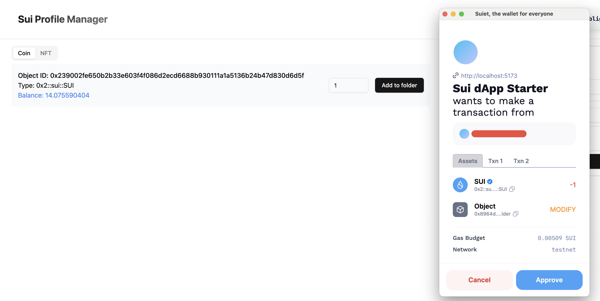
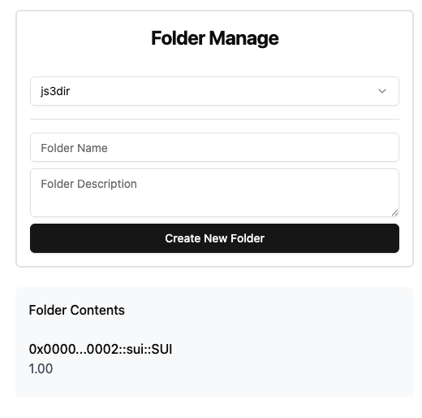

# week2

## 合约部署

```bash
sui client publish
......
╭─────────────────────────────────────────────────────────────────────────────────────────────────────╮
│ Object Changes                                                                                      │
├─────────────────────────────────────────────────────────────────────────────────────────────────────┤
│ Created Objects:                                                                                    │
│  ┌──                                                                                                │
│  │ ObjectID: 0x32ef700aa2342f91f3b607987f7267e88f997d67e302cb7ef0bb7a89ddb50691                     │
│  │ Sender: 0xe3f8a3e7deda9844fc1185712b9af96bf5b1dcb6388ef12699157589b121c5e2                       │
│  │ Owner: Shared( 282313758 )                                                                       │
│  │ ObjectType: 0x8964d4929d5def8be58e6c09fed9f132130f9b38b06859ec0b2fc714185fdd9c::week_two::State  │
│  │ Version: 282313758                                                                               │
│  │ Digest: 76tjuNXq9rm1Xvk2csvdAdWDVqa3A2jhTVDqm92horVn                                             │
│  └──                                                                                                │
│  ┌──                                                                                                │
│  │ ObjectID: 0xcf1c251f44b74e7206beb855f48f0ce38a8d3539294ee91083a8317e40d6de0c                     │
│  │ Sender: 0xe3f8a3e7deda9844fc1185712b9af96bf5b1dcb6388ef12699157589b121c5e2                       │
│  │ Owner: Account Address ( 0xe3f8a3e7deda9844fc1185712b9af96bf5b1dcb6388ef12699157589b121c5e2 )    │
│  │ ObjectType: 0x2::package::UpgradeCap                                                             │
│  │ Version: 282313758                                                                               │
│  │ Digest: Cnygz9GuYqUaWzouZ2VBoXTSBRpix9ywKznudmJd6b3h                                             │
│  └──                                                                                                │
│ Mutated Objects:                                                                                    │
│  ┌──                                                                                                │
│  │ ObjectID: 0x220adf430617fe2e577cf8803277e794e2ec954ec402ec2dda64daa4e4defe51                     │
│  │ Sender: 0xe3f8a3e7deda9844fc1185712b9af96bf5b1dcb6388ef12699157589b121c5e2                       │
│  │ Owner: Account Address ( 0xe3f8a3e7deda9844fc1185712b9af96bf5b1dcb6388ef12699157589b121c5e2 )    │
│  │ ObjectType: 0x2::coin::Coin<0x2::sui::SUI>                                                       │
│  │ Version: 282313758                                                                               │
│  │ Digest: JC9hNg6qSNFzSxCmudWvJz4CPra6gGbyYmdZKa3wVoP4                                             │
│  └──                                                                                                │
│ Published Objects:                                                                                  │
│  ┌──                                                                                                │
│  │ PackageID: 0x8964d4929d5def8be58e6c09fed9f132130f9b38b06859ec0b2fc714185fdd9c                    │
│  │ Version: 1                                                                                       │
│  │ Digest: Chc1WnF3xH5mPcZp1k6KonSf8isXfNJMWPnGvA5ZnDhj                                             │
│  │ Modules: week_two                                                                                │
│  └──                                                                                                │
╰─────────────────────────────────────────────────────────────────────────────────────────────────────╯
```

## 记录变量

```
packageID: "0x8964d4929d5def8be58e6c09fed9f132130f9b38b06859ec0b2fc714185fdd9c"
state:"0x32ef700aa2342f91f3b607987f7267e88f997d67e302cb7ef0bb7a89ddb50691"
```

## 添加代币到文件夹






## 资源

### graphql测试面板

https://sui-testnet.mystenlabs.com/graphql