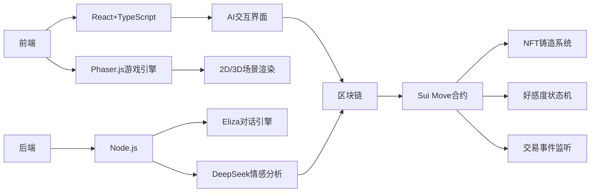

## project

- 项目名称: Love Link

> 描述: AI 恋爱模拟游戏：Sui 链上的心动之旅 🌸
>
> **在 Sui 区块链上构建的下一代 AI 互动游戏**  
> 玩家通过与多个不同性格和背景的 AI 角色约会，解锁隐藏故事，收集独特 NFT，体验数字时代的浪漫关系

## ✨ 核心功能
- **多类型 AI 角色**  
  温柔学姐、傲娇偶像、神秘艺术家...每个角色拥有独立 Sui 钱包地址
- **动态好感度系统**  
  - 通过聊天提升好感度（自然语言处理 + 情感分析）
  - 赠送 NFT 礼物获得加成（Sui Move 智能合约）
- **链上里程碑奖励**  
  - 30%：解锁角色秘密日记
  - 70%：获得约会邀请函
  - 100%：铸造永恒誓约 NFT
- **去中心化存储**  
  角色记忆、对话记录、礼物数据和NFT的资源通过 Walrus 保存

## 🛠️ 技术架构

## Member

- Ch1hiro  github: https://github.com/Ch1hiro4002

> 自我介绍&技术栈:  一名致力于在Sui上打造个人幻想的游戏世界的开发小白

